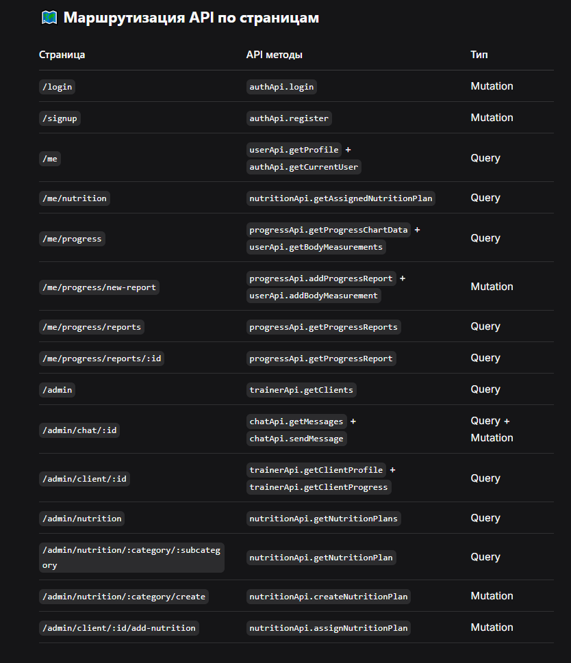

📁 Структура папок и их назначение:

1. store/types/ - Типы TypeScript
   Здесь хранятся все интерфейсы и типы для типобезопасности

2. store/slices/ - Слайсы для синхронного состояния
   Для данных, которые НЕ приходят с API (UI состояние, формы и т.д.)

3. store/api/ - RTK Query endpoints
   Для всех запросов к серверу (автоматическое кэширование, загрузка, ошибки)

4. store/hooks.ts - Кастомные хуки
   Для удобной работы с Redux в компонентах

5. store/index.ts - Главный файл store
   Объединяет всё в один store

   

6. Использование в компонентах:

```
import { useGetProfileQuery } from '../store/api/user.api';
import { useAppSelector, useAppDispatch } from '../store/hooks';
const MyComponent = () => {
  const dispatch = useAppDispatch();
  const { user } = useAppSelector(state => state.auth);
  const { data: profile, isLoading } = useGetProfileQuery(user?.id || '');
  // ... логика компонента
};
```

♻️ Best Practices:

- Для серверных данных → Всегда используйте RTK Query

- Для локального состояния → Используйте слайсы

- Типизация → Всегда указывайте типы для полной безопасности

- Ошибки → Обрабатывайте состояния loading/error в компонентах

- Оптимизация → Используйте providesTags и invalidatesTags для кэширования
